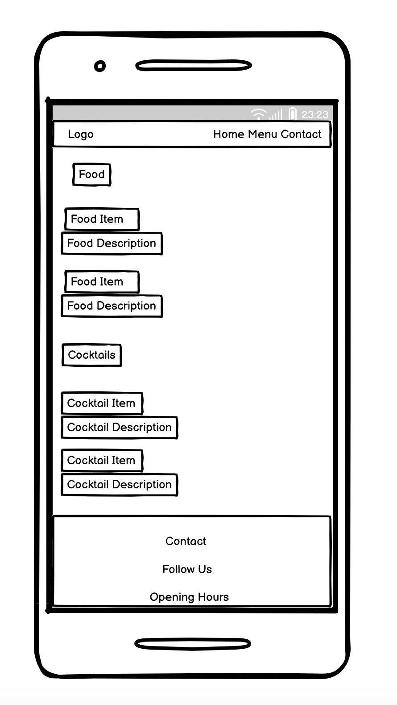
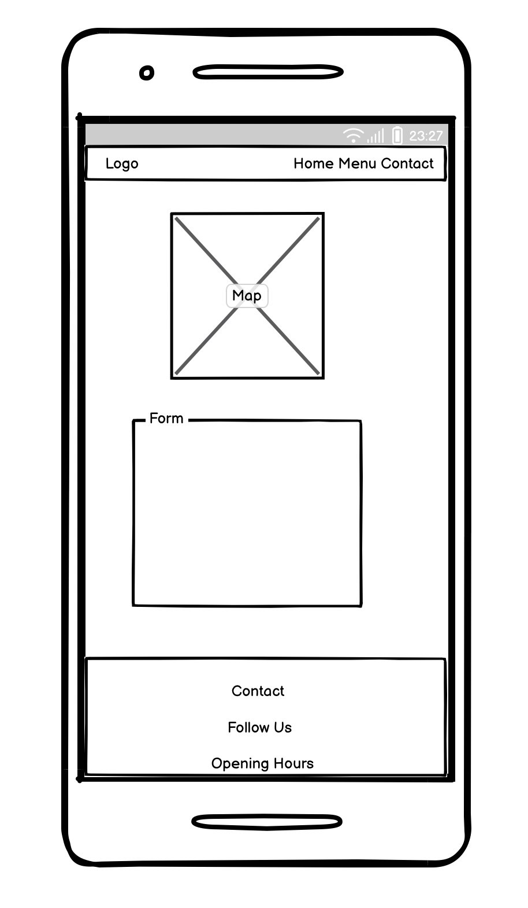
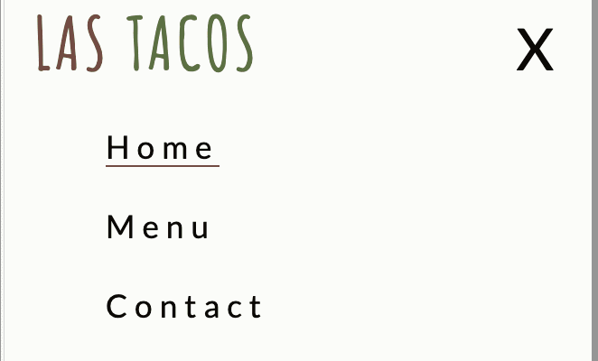
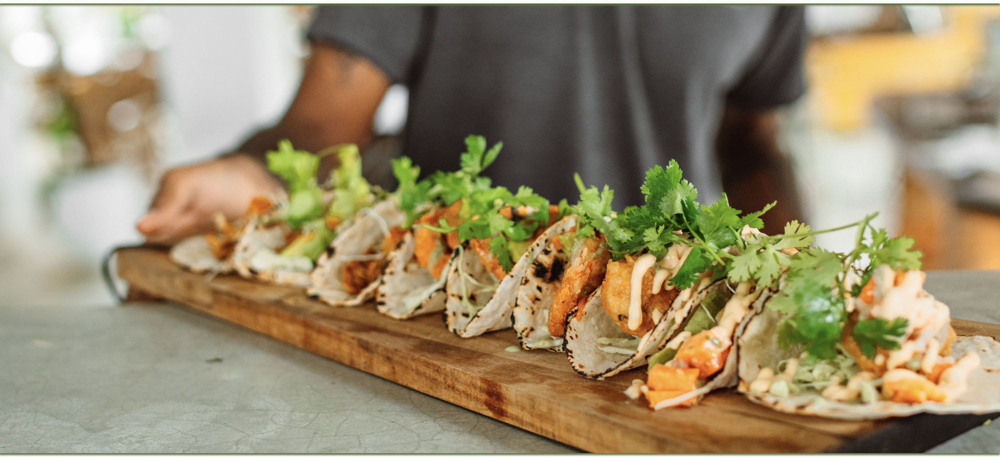
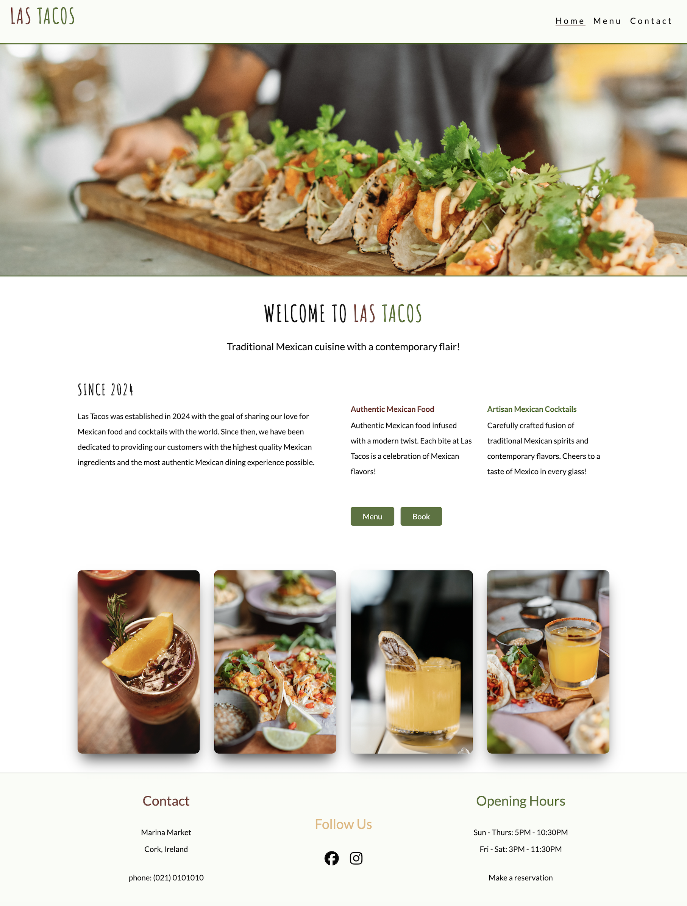
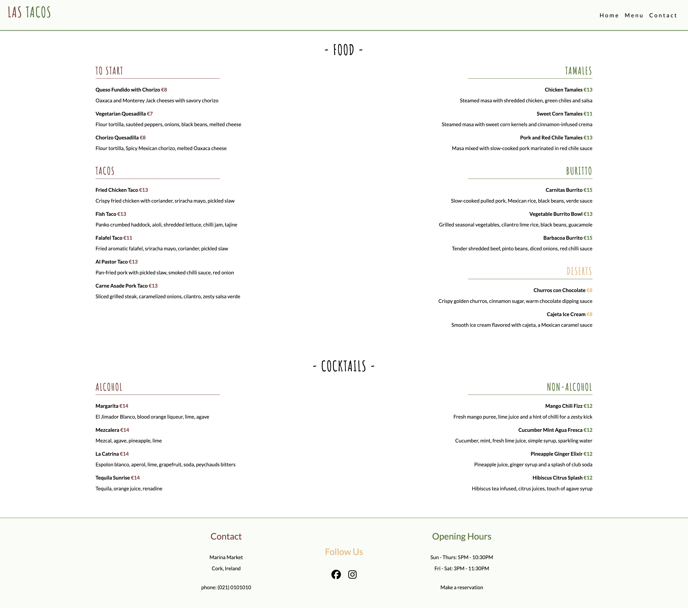
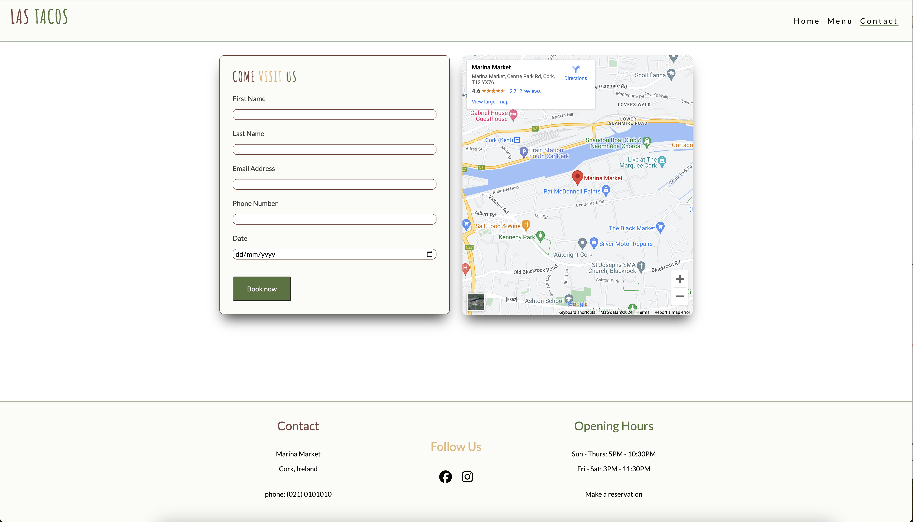

# Las Tacos

Las Tacos is a fictional Mexican restaurant located in the heart of Cork city. Las Tacos offers an authentic Mexican dining experience. The food is a modern twist on time-honoured recipes. The cocktails are a fusion of traditional Mexican spirits and contemporary flavours.

The purpose of this website is to promote Las Tacos and to provide information to customers about the restaurant, its menu and contact options. The website targets an audience of customers who enjoy Mexican food in a causal dining experience.

Visit the deployed website [here](https://alvor1991.github.io/Las-Tacos-PP1/).

## Table of Contents

1. [User Experience (UX)](#user-experience-ux)
    1. [Project Goals](#project-goals)
    2. [User Stories](#user-stories)
    3. [Color Scheme](#color-scheme)
    4. [Typography](#typography)
    5. [Wireframes](#wireframes)
2. [Features](#features)
    1. [General](#general)
    2. [Landing Page](#landing-page)
    3. [Menu Page](#menu-page)
    4. [Contact Page](#contact-page)
 3. [Technologies Used](#technologies-used)
    1. [Languages Used](#languages-used)
    2. [Frameworks, Libraries and Programs Used](#frameworks-libraries-and-programs-used)
4. [Testing](#testing)
    1. [Testing User Stories](#testing-user-stories)
    2. [Code Validation](#code-validation)
    3. [Accessibility](#accessibility)
    4. [Tools Testing](#tools-testing)
    5. [Manual Testing](#manual-testing)
5. [Finished Product](#finished-product)
6. [Deployment](#deployment)
    1. [GitHub Pages](#github-pages)
7. [Credits](#credits)
    1. [Content](#content)
    2. [Media](#media)
    3. [Code](#code)
8. [Acknowledgements](#acknowledgements)

***

## User Experience (UX)

### Project Goals

* Showcase Mexican cuisine - highlight the rich and diverse flavors of Mexican cuisine through engaging visuals and descriptions.

* Provide a seamless user experience - design an intuitive and user-friendly website structure with easy navigation between pages. 

* Encourage customer engagement - include clear calls-to-action, inviting visitors to explore the menu, make reservations or get in touch. 

* Generate interest and drive traffic - optimize the website for search engines to increase visibility and attract customers. 

### User Stories

* As a customer, I want to be able to navigate the website intuitively and learn more about the restaurant.

* As a customer, I want to be able to read more about the food and cocktail options available.

* As a customer, I want to easily find the contact information for the business.

* As a customer, I want to find social media links to the business.

* As a customer, I want to be able to book a reservation directly from the website.

* As a customer, I want to easily find the business' location.

### Color Scheme

The colors used in the site are red (#784742), yellow (#E5B87B), two shades of green (#56733C and #FAFCF7) and the colour white for the main background. These colours represent Cinco de Mayo, a celebration of Mexico. I recreated the Mexican flag in the navigation bar and footer elements. A shade of gold is used instead of white, as I wanted the colour to stand out more against a light clean background. For the menu section, the left side is red and the right side is green, consistent with the Las Tacos logo. The desserts heading is in gold to give the menu the complete colour selection and highlight desserts as an indulgent and luxury item.

### Typography

I want the site to have both an authentic and modern feel. Amatic SC is used for the headings, which gives the site a friendly and informal vibe. It evokes a sense of traditional Mexican art, adding a touch of authenticity to the site. It is also used for the logo, reinforcing the Las Tacos brand. The main font used in the site is Lato, with Sans Serif as the fallback font in case Lato is not being imported correctly. The combination of Amatic SC and Lato creates a cohesive visual identity. 

### Wireframes

[Balsamiq](https://balsamiq.com/) was used to create a layout of the website in the planning phase. Here are my initial designs for the layout. 

Page | Desktop Version | Mobile Version
--- | --- | ---
Index |  | 
Menu |  | 
Contact |  | 

[Back to top ⇧](#las-tacos)

## Features

### General

* Responsive design across all device sizes.

* Similar color scheme and design throughout all pages to effectively structure, categorise and present the information to customers.

* **Header**

    
    - The header contains the business logo and fully responsive navigation bar positioned across the top of the screen.

    - The business logo functions as a link to the landing page.

    - The navigation bar is identical in all pages and contains links to all pages to facilitate navigation across the site. It also has a hover effect that changes color to keep with the colour scheme.

    - The navigation bar will collapse on mobile and offer a toggle feature for customers, as shown below.

* **Footer**

    - The footer includes a smaller version of the logo and link to the business' social media channels.

### Landing Page

* **Hero Image**

    - The hero image is designed to attract the customer's attention with a fresh and modern look.

* **Info Section**

    - Contains a welcome heading and welcome statement. This section communicates the essence of the site and entices customers to explore more about the unique culinary offerings.

* **Intro Section**

    - Provides a glimpse into the history, mission, and the unique experience that the business offers. It also provides an option to book a reservation or view the food and cocktails menu. 

* **Image Section**

    - Contains images, giving the customer a taste of what Mexican food and cocktails the business has to offer. Each image is fully responsive and provides a link to the menu page.

### Menu Page

* **Food Section**

    - This section provides customers with all the food items available.  

    - The food section is fully responsive and easy to replicate in case more food items need to be added.

* **Cocktail Section**

    - This section provides customers with all the cocktails items available.  

    - The food section is fully responsive and easy to replicate in case more cocktail items need to be added.

### Contact Page

* **Contact Section**

    - The form allows customers to book a reservation on a specific date directly from the business' website.
    
    - The map displays a Google map of the business' geographical location. This allows customers to easily find the location from their devices.

[Back to top ⇧](#las-tacos)

## Technologies Used

### Languages Used
* [HTML5](https://en.wikipedia.org/wiki/HTML5)
* [CSS3](https://en.wikipedia.org/wiki/CSS)

### Frameworks, Libraries and Programs Used

* [Bootsrap](https://getbootstrap.com/)
    - Bootsrap was used to organise pages into rows and columns for a clean layout.

* [Google Fonts](https://fonts.google.com/)
    - Google Fonts was used to import the fonts Amatic SC and Lato into the style.css file. These fonts were used throughout the site.

* [Font Awesome](https://fontawesome.com/)
     - Font Awesome was used throughout all pages to add icons in order to create a better visual experience for UX purposes.

* [Codeanywhere](https://codeanywhere.com/)
     - GitPod was used for writing code, committing, and then pushing to GitHub.

* [GitHub](https://github.com/)
     - GitHub was used to store the project after pushing.

* [Balsamiq](https://balsamiq.com/)
     - Balsamiq was used to create the wireframes during the design phase of the project.

* [Am I Responsive?](http://ami.responsivedesign.is/)
    - Am I Responsive was used in order to see responsive design throughout the process and to generate mockup imagery to be used.

* [Responsive Design Checker](https://www.responsivedesignchecker.com/)
    - Responsive Design Checker was used in the testing process to check responsiveness on various devices.

* [Chrome DevTools](https://developer.chrome.com/docs/devtools/)
    - Chrome DevTools was used during development process for code review and to test responsiveness.

* [W3C Markup Validator](https://validator.w3.org/)
    - W3C Markup Validator was used to validate the HTML code.

* [W3C CSS Validator](https://jigsaw.w3.org/css-validator/)
    - W3C CSS Validator was used to validate the CSS code.

[Back to top ⇧](#las-tacos)

## Testing

### Testing User Stories

* As a customer, I want to be able to navigate the website intuitively and learn more about the business.

     - The website offers an intuitive structure for customers to navigate and find the information they are looking for.

    - The navigation bar is clearly presented in all pages for customers to find with ease and it is easily navigable.

* As a customer, I want to be able to read more about the food and cocktail options available.

    - The menu page presents all food and cocktail options available.

    - Each food and cocktail item have a description and price.

* As a customer, I want to easily find the contact information for the business.

    - The footer contains a clear contact section with all necessary business' contacts.

* As a customer, I want to find social media links to the business.

    - The footer provides links to the business' social media channels.

* As a customer, I want to be able to book a reservation directly from the website.

    - The contact page provides a reservation form for the customer to book a reservation.

    - The contact page can be accessed in three separate ways: the navigation bar, a button on the landing page and in the footer.

* As a customer, I want to easily find the business' location.

    - The contact page contains a find us section with a Google map of the business' geographical location.

### Code Validation

* The [W3C Markup Validator](https://validator.w3.org/) and [W3C CSS Validator](https://jigsaw.w3.org/css-validator/) services were used to validate all pages of the project in order to ensure there were no syntax errors.

    - On the Home page, the W3C Markup Validator found errors concerning headings not being included on the hero section, the intro section and the image section. The hero section tags and image section tags were replaced with divs. The intro section h1 element was replaced with a h2 element.

    - On the Menu page, the W3C Markup Validator found errors regarding duplicate ID values for section tags. I replaced these IDs with classes. Another error was found concerning h1 element to be used as a top-level heading only. I replaced this with a h2 element.

    - On the Contact page, the W3C Markup Validator found errors concerning the iframe - a bad value of 100% for attribute width. Removed html iframe styling and replaced the same values in custom CSS. 
    
    - W3C CSS Validator found no errors or warnings on my CSS.

### Accessibility

* Used Lighthouse in Chrome DevTools to confirm that colours and fonts used throughout the website are easy to read and accessible.

* Lighthouse reports

    - **Landing Page**

    

    - **Menu Page**

    

    - **Contact Page**

    

### Tools Testing

* [Chrome DevTools](https://developer.chrome.com/docs/devtools/)

    - Chrome DevTools was used during the development process to test, explore and modify HTML elements and CSS styles used in the project.

* Responsiveness
    
    - [Am I Responsive?](http://ami.responsivedesign.is/#) was used to check responsiveness of the site pages across different devices.

    - [Responsive Design Checker](https://www.responsivedesignchecker.com/) was used to check responsiveness on different screen sizes.
    
    - Chrome DevTools was used to test responsiveness in different screen sizes during development.

### Manual Testing

* Browser Compatibility

    - The website has been tested on the following browsers:

        - **Goolgle Chrome**
        
        No appearance, responsiveness or functionality issues.

        - **Safari**
        
        No appearance, responsiveness or functionality issues.

        - **Mozilla Firefox**
        
        No appearance, responsiveness or functionality issues.

* Device compatibility

    - The website has been tested on multiple devices, including:

        - **MacBook Air"**

        No appearance, responsiveness nor functionality issues.

        - **iMac20,1**

        No appearance, responsiveness nor functionality issues.

         - **iPhone 12**

        No appearance, responsiveness nor functionality issues.

        - **iPhone 11**

        No appearance, responsiveness nor functionality issues.

* Common Elements Testing

    - All Pages
        
        - **Header**

            - Clicking on the main logo will bring the customer back to the landing page.

        - **Navigation Bar**

            - Hovering on the navigation bar links will trigger a hover effect, highlighting a different colour for each heading and an accompanying underline.

            - Clicking on the navigation bar links will bring the customer to the specified page.
        
        - **Footer**
        
            - Clicking on the social media links will open the specific website on a new tab.

    - Landing Page

        - Hovering on the menu button link in the intro section will trigger a hover effect, highlighting the button for the customer.

        - Clicking on the menu button link in the intro section will bring the customer to the menu page.

        - Hovering on the book button link in the intro section will trigger a hover effect, highlighting the button for the customer.

        - Clicking on the book button link in the intro section will bring the customer to the contact page.

    - Contact Page

        - When filling out the contact form, the customer is required to complete all fields before submitting.
        
        - Hovering over the book button will trigger hover effect, highlighting the button for the customer.

        - Clicking and dragging on the map will move the area shown on the map. 
        
        - Clicking the plus and minus buttons changes the zoom of the map.

[Back to top ⇧](#las-tacos)

## Finished Product

Page | Desktop version | Mobile version
--- | --- | ---
Index |  | 
Menu |  | 
Contact |  | 

[Back to top ⇧](#las-tacos)

## Deployment

* This website was developed using [Codeanywhere](https://codeanywhere.com/), which was then committed and pushed to GitHub using the Codeanywhere terminal.

### GitHub Pages

* Here are the steps to deploy this website to GitHub Pages from its GitHub repository:

    1. Log in to GitHub and locate the [GitHub Repository](https://github.com/).

    2. At the top of the Repository, locate the Settings button on the menu.

        - Alternatively click [here](https://raw.githubusercontent.com/) for a GIF demostration of the process.

    3. Scroll down the Settings page until you locate the Pages section.

    4. Under Source, click the dropdown called None and select Master Branch.

    5. The page will refresh automatically and generate a link to your website.

[Back to top ⇧](#las-tacos)

## Credits 

### Content

- All content was written by the developer.

- Inspiration for the nav toggle bar was taken from the Love Running Project.

- Inspiration for the responsive food and cocktail menu on all screen sizes was taken from the Love Running Project.

### Media

* [Pexels](https://www.pexels.com/)

    - Hero image: "mexican tacos on the wooden board" by Roman Odinstov.
    - Image section cocktail-1 image: "glass of cold cocktail with orange" taken by Charlotte May.
    - Image section tacos-3 image: "mexican tacos with salsa" taken by Roman Odinstov.
    - Image section cocktail-2 image: "clear drinking glass with yellow liquid" taken by cottonbro studio.
    - Image section tacos-3 image: "clear drinking glass with yellow liquid" taken by Roman Odinstov.

### Code

* [W3Schools](https://www.w3schools.com/) was consulted on a regular basis for inspiration.
* [The Odin Project](https://www.theodinproject.com/) was consulted on a regular basis for inspiration.
* [Flexbox Froggy](https://flexboxfroggy.com/) was consulted for learning CSS flexbox.
* [Adobe Colour Wheel](https://color.adobe.com/create/color-wheel) was consulted for my colour scheme.

[Back to top ⇧](#las-tacos)

## Acknowledgements

* Code Institute and the Slack community for their support, knowledge and feedback.

* My tutor, Marcel, for his invaluable feedback and guidance.

[Back to top ⇧](#las-tacos)

